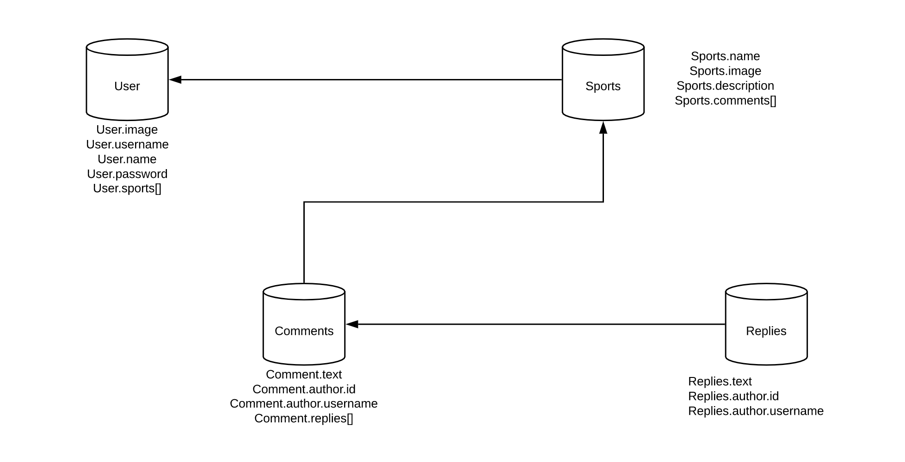

<h1>Sport Camp</h1>

The Sport Camp is a social media platform that allows sport enthusiast to share their favorite sport. The project utilizes NodeJs and MangoDb 

The project allows user to retrieve, post, edit and delete their favorite sport

<h3>The Home Page</h3>

<h3>The Sports Page</h3>

<h3>The Profile Page</h3>

<h3>The Show Page</h3>

<h2>Development Detail</h2>

The project uses Restful model to meet the users’ requests to create, show, edit and delete. The following table shows the routing included in project

   

Sports

  <table style="border:none;border-collapse:collapse;width:468pt;table-layout:fixed;">
    <tbody>
      <tr style="height:0pt;">
        <td style="border-left:solid #000000 1pt;border-right:solid #000000 1pt;border-bottom:solid #000000 1pt;border-top:solid #000000 1pt;vertical-align:top;padding:5pt 5pt 5pt 5pt;overflow:hidden;overflow-wrap:break-word;">
          
File

        </td>
        <td style="border-left:solid #000000 1pt;border-right:solid #000000 1pt;border-bottom:solid #000000 1pt;border-top:solid #000000 1pt;vertical-align:top;padding:5pt 5pt 5pt 5pt;overflow:hidden;overflow-wrap:break-word;">
          
Purpose

        </td>
        <td style="border-left:solid #000000 1pt;border-right:solid #000000 1pt;border-bottom:solid #000000 1pt;border-top:solid #000000 1pt;vertical-align:top;padding:5pt 5pt 5pt 5pt;overflow:hidden;overflow-wrap:break-word;">
          
Path

        </td>
        <td style="border-left:solid #000000 1pt;border-right:solid #000000 1pt;border-bottom:solid #000000 1pt;border-top:solid #000000 1pt;vertical-align:top;padding:5pt 5pt 5pt 5pt;overflow:hidden;overflow-wrap:break-word;">
          
Method

        </td>
      </tr>
      <tr style="height:0pt;">
        <td style="border-left:solid #000000 1pt;border-right:solid #000000 1pt;border-bottom:solid #000000 1pt;border-top:solid #000000 1pt;vertical-align:top;padding:5pt 5pt 5pt 5pt;overflow:hidden;overflow-wrap:break-word;">
          
Index

        </td>
        <td style="border-left:solid #000000 1pt;border-right:solid #000000 1pt;border-bottom:solid #000000 1pt;border-top:solid #000000 1pt;vertical-align:top;padding:5pt 5pt 5pt 5pt;overflow:hidden;overflow-wrap:break-word;">
          
List all Sports

        </td>
        <td style="border-left:solid #000000 1pt;border-right:solid #000000 1pt;border-bottom:solid #000000 1pt;border-top:solid #000000 1pt;vertical-align:top;padding:5pt 5pt 5pt 5pt;overflow:hidden;overflow-wrap:break-word;">
          
/sports

        </td>
        <td style="border-left:solid #000000 1pt;border-right:solid #000000 1pt;border-bottom:solid #000000 1pt;border-top:solid #000000 1pt;vertical-align:top;padding:5pt 5pt 5pt 5pt;overflow:hidden;overflow-wrap:break-word;">
          
GET

        </td>
      </tr>
      <tr style="height:0pt;">
        <td style="border-left:solid #000000 1pt;border-right:solid #000000 1pt;border-bottom:solid #000000 1pt;border-top:solid #000000 1pt;vertical-align:top;padding:5pt 5pt 5pt 5pt;overflow:hidden;overflow-wrap:break-word;">
          
New

        </td>
        <td style="border-left:solid #000000 1pt;border-right:solid #000000 1pt;border-bottom:solid #000000 1pt;border-top:solid #000000 1pt;vertical-align:top;padding:5pt 5pt 5pt 5pt;overflow:hidden;overflow-wrap:break-word;">
          
Show a new sport

        </td>
        <td style="border-left:solid #000000 1pt;border-right:solid #000000 1pt;border-bottom:solid #000000 1pt;border-top:solid #000000 1pt;vertical-align:top;padding:5pt 5pt 5pt 5pt;overflow:hidden;overflow-wrap:break-word;">
          
/sports/new

        </td>
        <td style="border-left:solid #000000 1pt;border-right:solid #000000 1pt;border-bottom:solid #000000 1pt;border-top:solid #000000 1pt;vertical-align:top;padding:5pt 5pt 5pt 5pt;overflow:hidden;overflow-wrap:break-word;">
          
GET

        </td>
      </tr>
      <tr style="height:0pt;">
        <td style="border-left:solid #000000 1pt;border-right:solid #000000 1pt;border-bottom:solid #000000 1pt;border-top:solid #000000 1pt;vertical-align:top;padding:5pt 5pt 5pt 5pt;overflow:hidden;overflow-wrap:break-word;">
          
Create

        </td>
        <td style="border-left:solid #000000 1pt;border-right:solid #000000 1pt;border-bottom:solid #000000 1pt;border-top:solid #000000 1pt;vertical-align:top;padding:5pt 5pt 5pt 5pt;overflow:hidden;overflow-wrap:break-word;">
          
Create a new sport

        </td>
        <td style="border-left:solid #000000 1pt;border-right:solid #000000 1pt;border-bottom:solid #000000 1pt;border-top:solid #000000 1pt;vertical-align:top;padding:5pt 5pt 5pt 5pt;overflow:hidden;overflow-wrap:break-word;">
          
/sports

        </td>
        <td style="border-left:solid #000000 1pt;border-right:solid #000000 1pt;border-bottom:solid #000000 1pt;border-top:solid #000000 1pt;vertical-align:top;padding:5pt 5pt 5pt 5pt;overflow:hidden;overflow-wrap:break-word;">
          
POST

        </td>
      </tr>
      <tr style="height:0pt;">
        <td style="border-left:solid #000000 1pt;border-right:solid #000000 1pt;border-bottom:solid #000000 1pt;border-top:solid #000000 1pt;vertical-align:top;padding:5pt 5pt 5pt 5pt;overflow:hidden;overflow-wrap:break-word;">
          
Show

        </td>
        <td style="border-left:solid #000000 1pt;border-right:solid #000000 1pt;border-bottom:solid #000000 1pt;border-top:solid #000000 1pt;vertical-align:top;padding:5pt 5pt 5pt 5pt;overflow:hidden;overflow-wrap:break-word;">
          
Show a specific sport&nbsp;

        </td>
        <td style="border-left:solid #000000 1pt;border-right:solid #000000 1pt;border-bottom:solid #000000 1pt;border-top:solid #000000 1pt;vertical-align:top;padding:5pt 5pt 5pt 5pt;overflow:hidden;overflow-wrap:break-word;">
          
/sports/:id

        </td>
        <td style="border-left:solid #000000 1pt;border-right:solid #000000 1pt;border-bottom:solid #000000 1pt;border-top:solid #000000 1pt;vertical-align:top;padding:5pt 5pt 5pt 5pt;overflow:hidden;overflow-wrap:break-word;">
          
GET

        </td>
      </tr>
      <tr style="height:0pt;">
        <td style="border-left:solid #000000 1pt;border-right:solid #000000 1pt;border-bottom:solid #000000 1pt;border-top:solid #000000 1pt;vertical-align:top;padding:5pt 5pt 5pt 5pt;overflow:hidden;overflow-wrap:break-word;">
          
Edit

        </td>
        <td style="border-left:solid #000000 1pt;border-right:solid #000000 1pt;border-bottom:solid #000000 1pt;border-top:solid #000000 1pt;vertical-align:top;padding:5pt 5pt 5pt 5pt;overflow:hidden;overflow-wrap:break-word;">
          
Edit a specific sport

        </td>
        <td style="border-left:solid #000000 1pt;border-right:solid #000000 1pt;border-bottom:solid #000000 1pt;border-top:solid #000000 1pt;vertical-align:top;padding:5pt 5pt 5pt 5pt;overflow:hidden;overflow-wrap:break-word;">
          
/sports/:id/edit

        </td>
        <td style="border-left:solid #000000 1pt;border-right:solid #000000 1pt;border-bottom:solid #000000 1pt;border-top:solid #000000 1pt;vertical-align:top;padding:5pt 5pt 5pt 5pt;overflow:hidden;overflow-wrap:break-word;">
          
GET

        </td>
      </tr>
      <tr style="height:0pt;">
        <td style="border-left:solid #000000 1pt;border-right:solid #000000 1pt;border-bottom:solid #000000 1pt;border-top:solid #000000 1pt;vertical-align:top;padding:5pt 5pt 5pt 5pt;overflow:hidden;overflow-wrap:break-word;">
          
Update

        </td>
        <td style="border-left:solid #000000 1pt;border-right:solid #000000 1pt;border-bottom:solid #000000 1pt;border-top:solid #000000 1pt;vertical-align:top;padding:5pt 5pt 5pt 5pt;overflow:hidden;overflow-wrap:break-word;">
          
Update a specific sport with new data

        </td>
        <td style="border-left:solid #000000 1pt;border-right:solid #000000 1pt;border-bottom:solid #000000 1pt;border-top:solid #000000 1pt;vertical-align:top;padding:5pt 5pt 5pt 5pt;overflow:hidden;overflow-wrap:break-word;">
          
/sports/:id

           
        </td>
        <td style="border-left:solid #000000 1pt;border-right:solid #000000 1pt;border-bottom:solid #000000 1pt;border-top:solid #000000 1pt;vertical-align:top;padding:5pt 5pt 5pt 5pt;overflow:hidden;overflow-wrap:break-word;">
          
PUT

        </td>
      </tr>
      <tr style="height:0pt;">
        <td style="border-left:solid #000000 1pt;border-right:solid #000000 1pt;border-bottom:solid #000000 1pt;border-top:solid #000000 1pt;vertical-align:top;padding:5pt 5pt 5pt 5pt;overflow:hidden;overflow-wrap:break-word;">
          
Delete

        </td>
        <td style="border-left:solid #000000 1pt;border-right:solid #000000 1pt;border-bottom:solid #000000 1pt;border-top:solid #000000 1pt;vertical-align:top;padding:5pt 5pt 5pt 5pt;overflow:hidden;overflow-wrap:break-word;">
          
Delete a specific sport

        </td>
        <td style="border-left:solid #000000 1pt;border-right:solid #000000 1pt;border-bottom:solid #000000 1pt;border-top:solid #000000 1pt;vertical-align:top;padding:5pt 5pt 5pt 5pt;overflow:hidden;overflow-wrap:break-word;">
          
/sports/:id

        </td>
        <td style="border-left:solid #000000 1pt;border-right:solid #000000 1pt;border-bottom:solid #000000 1pt;border-top:solid #000000 1pt;vertical-align:top;padding:5pt 5pt 5pt 5pt;overflow:hidden;overflow-wrap:break-word;">
          
Delete

        </td>
      </tr>
    </tbody>
  </table>

   

Comments

  <table style="border:none;border-collapse:collapse;">
    <tbody>
      <tr style="height:24pt;">
        <td style="border-left:solid #000000 0.9984375000000001pt;border-right:solid #000000 0.9984375000000001pt;border-bottom:solid #000000 0.9984375000000001pt;border-top:solid #000000 0.9984375000000001pt;vertical-align:top;padding:5pt 5pt 5pt 5pt;overflow:hidden;overflow-wrap:break-word;">
          
File

        </td>
        <td style="border-left:solid #000000 0.9984375000000001pt;border-right:solid #000000 0.9984375000000001pt;border-bottom:solid #000000 0.9984375000000001pt;border-top:solid #000000 0.9984375000000001pt;vertical-align:top;padding:5pt 5pt 5pt 5pt;overflow:hidden;overflow-wrap:break-word;">
          
Purpose

        </td>
        <td style="border-left:solid #000000 0.9984375000000001pt;border-right:solid #000000 0.9984375000000001pt;border-bottom:solid #000000 0.9984375000000001pt;border-top:solid #000000 0.9984375000000001pt;vertical-align:top;padding:5pt 5pt 5pt 5pt;overflow:hidden;overflow-wrap:break-word;">
          
Path

        </td>
        <td style="border-left:solid #000000 0.9984375000000001pt;border-right:solid #000000 0.9984375000000001pt;border-bottom:solid #000000 0.9984375000000001pt;border-top:solid #000000 0.9984375000000001pt;vertical-align:top;padding:5pt 5pt 5pt 5pt;overflow:hidden;overflow-wrap:break-word;">
          
Method

        </td>
      </tr>
      <tr style="height:24pt;">
        <td style="border-left:solid #000000 0.9984375000000001pt;border-right:solid #000000 0.9984375000000001pt;border-bottom:solid #000000 0.9984375000000001pt;border-top:solid #000000 0.9984375000000001pt;vertical-align:top;padding:5pt 5pt 5pt 5pt;overflow:hidden;overflow-wrap:break-word;">
          
Index

        </td>
        <td style="border-left:solid #000000 0.9984375000000001pt;border-right:solid #000000 0.9984375000000001pt;border-bottom:solid #000000 0.9984375000000001pt;border-top:solid #000000 0.9984375000000001pt;vertical-align:top;padding:5pt 5pt 5pt 5pt;overflow:hidden;overflow-wrap:break-word;">
          
List all Comments

        </td>
        <td style="border-left:solid #000000 0.9984375000000001pt;border-right:solid #000000 0.9984375000000001pt;border-bottom:solid #000000 0.9984375000000001pt;border-top:solid #000000 0.9984375000000001pt;vertical-align:top;padding:5pt 5pt 5pt 5pt;overflow:hidden;overflow-wrap:break-word;">
          
/Comments

        </td>
        <td style="border-left:solid #000000 0.9984375000000001pt;border-right:solid #000000 0.9984375000000001pt;border-bottom:solid #000000 0.9984375000000001pt;border-top:solid #000000 0.9984375000000001pt;vertical-align:top;padding:5pt 5pt 5pt 5pt;overflow:hidden;overflow-wrap:break-word;">
          
GET

        </td>
      </tr>
      <tr style="height:24pt;">
        <td style="border-left:solid #000000 0.9984375000000001pt;border-right:solid #000000 0.9984375000000001pt;border-bottom:solid #000000 0.9984375000000001pt;border-top:solid #000000 0.9984375000000001pt;vertical-align:top;padding:5pt 5pt 5pt 5pt;overflow:hidden;overflow-wrap:break-word;">
          
New

        </td>
        <td style="border-left:solid #000000 0.9984375000000001pt;border-right:solid #000000 0.9984375000000001pt;border-bottom:solid #000000 0.9984375000000001pt;border-top:solid #000000 0.9984375000000001pt;vertical-align:top;padding:5pt 5pt 5pt 5pt;overflow:hidden;overflow-wrap:break-word;">
          
Show a new comment

        </td>
        <td style="border-left:solid #000000 0.9984375000000001pt;border-right:solid #000000 0.9984375000000001pt;border-bottom:solid #000000 0.9984375000000001pt;border-top:solid #000000 0.9984375000000001pt;vertical-align:top;padding:5pt 5pt 5pt 5pt;overflow:hidden;overflow-wrap:break-word;">
          
/Comments/new

        </td>
        <td style="border-left:solid #000000 0.9984375000000001pt;border-right:solid #000000 0.9984375000000001pt;border-bottom:solid #000000 0.9984375000000001pt;border-top:solid #000000 0.9984375000000001pt;vertical-align:top;padding:5pt 5pt 5pt 5pt;overflow:hidden;overflow-wrap:break-word;">
          
GET

        </td>
      </tr>
      <tr style="height:24pt;">
        <td style="border-left:solid #000000 0.9984375000000001pt;border-right:solid #000000 0.9984375000000001pt;border-bottom:solid #000000 0.9984375000000001pt;border-top:solid #000000 0.9984375000000001pt;vertical-align:top;padding:5pt 5pt 5pt 5pt;overflow:hidden;overflow-wrap:break-word;">
          
Create

        </td>
        <td style="border-left:solid #000000 0.9984375000000001pt;border-right:solid #000000 0.9984375000000001pt;border-bottom:solid #000000 0.9984375000000001pt;border-top:solid #000000 0.9984375000000001pt;vertical-align:top;padding:5pt 5pt 5pt 5pt;overflow:hidden;overflow-wrap:break-word;">
          
Create a new comment

        </td>
        <td style="border-left:solid #000000 0.9984375000000001pt;border-right:solid #000000 0.9984375000000001pt;border-bottom:solid #000000 0.9984375000000001pt;border-top:solid #000000 0.9984375000000001pt;vertical-align:top;padding:5pt 5pt 5pt 5pt;overflow:hidden;overflow-wrap:break-word;">
          
/Comments

        </td>
        <td style="border-left:solid #000000 0.9984375000000001pt;border-right:solid #000000 0.9984375000000001pt;border-bottom:solid #000000 0.9984375000000001pt;border-top:solid #000000 0.9984375000000001pt;vertical-align:top;padding:5pt 5pt 5pt 5pt;overflow:hidden;overflow-wrap:break-word;">
          
POST

        </td>
      </tr>
      <tr style="height:24pt;">
        <td style="border-left:solid #000000 0.9984375000000001pt;border-right:solid #000000 0.9984375000000001pt;border-bottom:solid #000000 0.9984375000000001pt;border-top:solid #000000 0.9984375000000001pt;vertical-align:top;padding:5pt 5pt 5pt 5pt;overflow:hidden;overflow-wrap:break-word;">
          
Show

        </td>
        <td style="border-left:solid #000000 0.9984375000000001pt;border-right:solid #000000 0.9984375000000001pt;border-bottom:solid #000000 0.9984375000000001pt;border-top:solid #000000 0.9984375000000001pt;vertical-align:top;padding:5pt 5pt 5pt 5pt;overflow:hidden;overflow-wrap:break-word;">
          
Show a specific comment&nbsp;

        </td>
        <td style="border-left:solid #000000 0.9984375000000001pt;border-right:solid #000000 0.9984375000000001pt;border-bottom:solid #000000 0.9984375000000001pt;border-top:solid #000000 0.9984375000000001pt;vertical-align:top;padding:5pt 5pt 5pt 5pt;overflow:hidden;overflow-wrap:break-word;">
          
/Comments/:comment_id

        </td>
        <td style="border-left:solid #000000 0.9984375000000001pt;border-right:solid #000000 0.9984375000000001pt;border-bottom:solid #000000 0.9984375000000001pt;border-top:solid #000000 0.9984375000000001pt;vertical-align:top;padding:5pt 5pt 5pt 5pt;overflow:hidden;overflow-wrap:break-word;">
          
GET

        </td>
      </tr>
      <tr style="height:24pt;">
        <td style="border-left:solid #000000 0.9984375000000001pt;border-right:solid #000000 0.9984375000000001pt;border-bottom:solid #000000 0.9984375000000001pt;border-top:solid #000000 0.9984375000000001pt;vertical-align:top;padding:5pt 5pt 5pt 5pt;overflow:hidden;overflow-wrap:break-word;">
          
Edit

        </td>
        <td style="border-left:solid #000000 0.9984375000000001pt;border-right:solid #000000 0.9984375000000001pt;border-bottom:solid #000000 0.9984375000000001pt;border-top:solid #000000 0.9984375000000001pt;vertical-align:top;padding:5pt 5pt 5pt 5pt;overflow:hidden;overflow-wrap:break-word;">
          
Edit a specific comment

        </td>
        <td style="border-left:solid #000000 0.9984375000000001pt;border-right:solid #000000 0.9984375000000001pt;border-bottom:solid #000000 0.9984375000000001pt;border-top:solid #000000 0.9984375000000001pt;vertical-align:top;padding:5pt 5pt 5pt 5pt;overflow:hidden;overflow-wrap:break-word;">
          
/Comments/:comment_id/edit

        </td>
        <td style="border-left:solid #000000 0.9984375000000001pt;border-right:solid #000000 0.9984375000000001pt;border-bottom:solid #000000 0.9984375000000001pt;border-top:solid #000000 0.9984375000000001pt;vertical-align:top;padding:5pt 5pt 5pt 5pt;overflow:hidden;overflow-wrap:break-word;">
          
GET

        </td>
      </tr>
      <tr style="height:37.5pt;">
        <td style="border-left:solid #000000 0.9984375000000001pt;border-right:solid #000000 0.9984375000000001pt;border-bottom:solid #000000 0.9984375000000001pt;border-top:solid #000000 0.9984375000000001pt;vertical-align:top;padding:5pt 5pt 5pt 5pt;overflow:hidden;overflow-wrap:break-word;">
          
Update

        </td>
        <td style="border-left:solid #000000 0.9984375000000001pt;border-right:solid #000000 0.9984375000000001pt;border-bottom:solid #000000 0.9984375000000001pt;border-top:solid #000000 0.9984375000000001pt;vertical-align:top;padding:5pt 5pt 5pt 5pt;overflow:hidden;overflow-wrap:break-word;">
          
Update a specific comment with new data

        </td>
        <td style="border-left:solid #000000 0.9984375000000001pt;border-right:solid #000000 0.9984375000000001pt;border-bottom:solid #000000 0.9984375000000001pt;border-top:solid #000000 0.9984375000000001pt;vertical-align:top;padding:5pt 5pt 5pt 5pt;overflow:hidden;overflow-wrap:break-word;">
          
/Comments/:comment_id

        </td>
        <td style="border-left:solid #000000 0.9984375000000001pt;border-right:solid #000000 0.9984375000000001pt;border-bottom:solid #000000 0.9984375000000001pt;border-top:solid #000000 0.9984375000000001pt;vertical-align:top;padding:5pt 5pt 5pt 5pt;overflow:hidden;overflow-wrap:break-word;">
          
PUT

        </td>
      </tr>
      <tr style="height:24pt;">
        <td style="border-left:solid #000000 0.9984375000000001pt;border-right:solid #000000 0.9984375000000001pt;border-bottom:solid #000000 0.9984375000000001pt;border-top:solid #000000 0.9984375000000001pt;vertical-align:top;padding:5pt 5pt 5pt 5pt;overflow:hidden;overflow-wrap:break-word;">
          
Delete

        </td>
        <td style="border-left:solid #000000 0.9984375000000001pt;border-right:solid #000000 0.9984375000000001pt;border-bottom:solid #000000 0.9984375000000001pt;border-top:solid #000000 0.9984375000000001pt;vertical-align:top;padding:5pt 5pt 5pt 5pt;overflow:hidden;overflow-wrap:break-word;">
          
Delete a specific comment

        </td>
        <td style="border-left:solid #000000 0.9984375000000001pt;border-right:solid #000000 0.9984375000000001pt;border-bottom:solid #000000 0.9984375000000001pt;border-top:solid #000000 0.9984375000000001pt;vertical-align:top;padding:5pt 5pt 5pt 5pt;overflow:hidden;overflow-wrap:break-word;">
          
/Comments/:comment_id

        </td>
        <td style="border-left:solid #000000 0.9984375000000001pt;border-right:solid #000000 0.9984375000000001pt;border-bottom:solid #000000 0.9984375000000001pt;border-top:solid #000000 0.9984375000000001pt;vertical-align:top;padding:5pt 5pt 5pt 5pt;overflow:hidden;overflow-wrap:break-word;">
          
Delete

        </td>
      </tr>
    </tbody>
  </table>

Users

  <table style="border:none;border-collapse:collapse;">
    <tbody>
      <tr style="height:24pt;">
        <td style="border-left:solid #000000 0.9984375000000001pt;border-right:solid #000000 0.9984375000000001pt;border-bottom:solid #000000 0.9984375000000001pt;border-top:solid #000000 0.9984375000000001pt;vertical-align:top;padding:5pt 5pt 5pt 5pt;overflow:hidden;overflow-wrap:break-word;">
          
File

        </td>
        <td style="border-left:solid #000000 0.9984375000000001pt;border-right:solid #000000 0.9984375000000001pt;border-bottom:solid #000000 0.9984375000000001pt;border-top:solid #000000 0.9984375000000001pt;vertical-align:top;padding:5pt 5pt 5pt 5pt;overflow:hidden;overflow-wrap:break-word;">
          
Purpose

        </td>
        <td style="border-left:solid #000000 0.9984375000000001pt;border-right:solid #000000 0.9984375000000001pt;border-bottom:solid #000000 0.9984375000000001pt;border-top:solid #000000 0.9984375000000001pt;vertical-align:top;padding:5pt 5pt 5pt 5pt;overflow:hidden;overflow-wrap:break-word;">
          
Path

        </td>
        <td style="border-left:solid #000000 0.9984375000000001pt;border-right:solid #000000 0.9984375000000001pt;border-bottom:solid #000000 0.9984375000000001pt;border-top:solid #000000 0.9984375000000001pt;vertical-align:top;padding:5pt 5pt 5pt 5pt;overflow:hidden;overflow-wrap:break-word;">
          
Method

        </td>
      </tr>
      <tr style="height:24pt;">
        <td style="border-left:solid #000000 0.9984375000000001pt;border-right:solid #000000 0.9984375000000001pt;border-bottom:solid #000000 0.9984375000000001pt;border-top:solid #000000 0.9984375000000001pt;vertical-align:top;padding:5pt 5pt 5pt 5pt;overflow:hidden;overflow-wrap:break-word;">
          
New

        </td>
        <td style="border-left:solid #000000 0.9984375000000001pt;border-right:solid #000000 0.9984375000000001pt;border-bottom:solid #000000 0.9984375000000001pt;border-top:solid #000000 0.9984375000000001pt;vertical-align:top;padding:5pt 5pt 5pt 5pt;overflow:hidden;overflow-wrap:break-word;">
          
Show a register form

        </td>
        <td style="border-left:solid #000000 0.9984375000000001pt;border-right:solid #000000 0.9984375000000001pt;border-bottom:solid #000000 0.9984375000000001pt;border-top:solid #000000 0.9984375000000001pt;vertical-align:top;padding:5pt 5pt 5pt 5pt;overflow:hidden;overflow-wrap:break-word;">
          
/register

        </td>
        <td style="border-left:solid #000000 0.9984375000000001pt;border-right:solid #000000 0.9984375000000001pt;border-bottom:solid #000000 0.9984375000000001pt;border-top:solid #000000 0.9984375000000001pt;vertical-align:top;padding:5pt 5pt 5pt 5pt;overflow:hidden;overflow-wrap:break-word;">
          
GET

        </td>
      </tr>
      <tr style="height:24pt;">
        <td style="border-left:solid #000000 0.9984375000000001pt;border-right:solid #000000 0.9984375000000001pt;border-bottom:solid #000000 0.9984375000000001pt;border-top:solid #000000 0.9984375000000001pt;vertical-align:top;padding:5pt 5pt 5pt 5pt;overflow:hidden;overflow-wrap:break-word;">
          
Register

        </td>
        <td style="border-left:solid #000000 0.9984375000000001pt;border-right:solid #000000 0.9984375000000001pt;border-bottom:solid #000000 0.9984375000000001pt;border-top:solid #000000 0.9984375000000001pt;vertical-align:top;padding:5pt 5pt 5pt 5pt;overflow:hidden;overflow-wrap:break-word;">
          
Create a new user

        </td>
        <td style="border-left:solid #000000 0.9984375000000001pt;border-right:solid #000000 0.9984375000000001pt;border-bottom:solid #000000 0.9984375000000001pt;border-top:solid #000000 0.9984375000000001pt;vertical-align:top;padding:5pt 5pt 5pt 5pt;overflow:hidden;overflow-wrap:break-word;">
          
/users

        </td>
        <td style="border-left:solid #000000 0.9984375000000001pt;border-right:solid #000000 0.9984375000000001pt;border-bottom:solid #000000 0.9984375000000001pt;border-top:solid #000000 0.9984375000000001pt;vertical-align:top;padding:5pt 5pt 5pt 5pt;overflow:hidden;overflow-wrap:break-word;">
          
POST

        </td>
      </tr>
      <tr style="height:24pt;">
        <td style="border-left:solid #000000 0.9984375000000001pt;border-right:solid #000000 0.9984375000000001pt;border-bottom:solid #000000 0.9984375000000001pt;border-top:solid #000000 0.9984375000000001pt;vertical-align:top;padding:5pt 5pt 5pt 5pt;overflow:hidden;overflow-wrap:break-word;">
          
Show

        </td>
        <td style="border-left:solid #000000 0.9984375000000001pt;border-right:solid #000000 0.9984375000000001pt;border-bottom:solid #000000 0.9984375000000001pt;border-top:solid #000000 0.9984375000000001pt;vertical-align:top;padding:5pt 5pt 5pt 5pt;overflow:hidden;overflow-wrap:break-word;">
          
Show a specific user&nbsp;

        </td>
        <td style="border-left:solid #000000 0.9984375000000001pt;border-right:solid #000000 0.9984375000000001pt;border-bottom:solid #000000 0.9984375000000001pt;border-top:solid #000000 0.9984375000000001pt;vertical-align:top;padding:5pt 5pt 5pt 5pt;overflow:hidden;overflow-wrap:break-word;">
          
/users/:id

        </td>
        <td style="border-left:solid #000000 0.9984375000000001pt;border-right:solid #000000 0.9984375000000001pt;border-bottom:solid #000000 0.9984375000000001pt;border-top:solid #000000 0.9984375000000001pt;vertical-align:top;padding:5pt 5pt 5pt 5pt;overflow:hidden;overflow-wrap:break-word;">
          
GET

        </td>
      </tr>
      <tr style="height:24pt;">
        <td style="border-left:solid #000000 0.9984375000000001pt;border-right:solid #000000 0.9984375000000001pt;border-bottom:solid #000000 0.9984375000000001pt;border-top:solid #000000 0.9984375000000001pt;vertical-align:top;padding:5pt 5pt 5pt 5pt;overflow:hidden;overflow-wrap:break-word;">
          
Edit

        </td>
        <td style="border-left:solid #000000 0.9984375000000001pt;border-right:solid #000000 0.9984375000000001pt;border-bottom:solid #000000 0.9984375000000001pt;border-top:solid #000000 0.9984375000000001pt;vertical-align:top;padding:5pt 5pt 5pt 5pt;overflow:hidden;overflow-wrap:break-word;">
          
Edit a specific user

        </td>
        <td style="border-left:solid #000000 0.9984375000000001pt;border-right:solid #000000 0.9984375000000001pt;border-bottom:solid #000000 0.9984375000000001pt;border-top:solid #000000 0.9984375000000001pt;vertical-align:top;padding:5pt 5pt 5pt 5pt;overflow:hidden;overflow-wrap:break-word;">
          
/users/:id/edit

        </td>
        <td style="border-left:solid #000000 0.9984375000000001pt;border-right:solid #000000 0.9984375000000001pt;border-bottom:solid #000000 0.9984375000000001pt;border-top:solid #000000 0.9984375000000001pt;vertical-align:top;padding:5pt 5pt 5pt 5pt;overflow:hidden;overflow-wrap:break-word;">
          
GET

        </td>
      </tr>
      <tr style="height:24pt;">
        <td style="border-left:solid #000000 0.9984375000000001pt;border-right:solid #000000 0.9984375000000001pt;border-bottom:solid #000000 0.9984375000000001pt;border-top:solid #000000 0.9984375000000001pt;vertical-align:top;padding:5pt 5pt 5pt 5pt;overflow:hidden;overflow-wrap:break-word;">
          
Update

        </td>
        <td style="border-left:solid #000000 0.9984375000000001pt;border-right:solid #000000 0.9984375000000001pt;border-bottom:solid #000000 0.9984375000000001pt;border-top:solid #000000 0.9984375000000001pt;vertical-align:top;padding:5pt 5pt 5pt 5pt;overflow:hidden;overflow-wrap:break-word;">
          
Update a specific user with new data

        </td>
        <td style="border-left:solid #000000 0.9984375000000001pt;border-right:solid #000000 0.9984375000000001pt;border-bottom:solid #000000 0.9984375000000001pt;border-top:solid #000000 0.9984375000000001pt;vertical-align:top;padding:5pt 5pt 5pt 5pt;overflow:hidden;overflow-wrap:break-word;">
          
/users/:id

        </td>
        <td style="border-left:solid #000000 0.9984375000000001pt;border-right:solid #000000 0.9984375000000001pt;border-bottom:solid #000000 0.9984375000000001pt;border-top:solid #000000 0.9984375000000001pt;vertical-align:top;padding:5pt 5pt 5pt 5pt;overflow:hidden;overflow-wrap:break-word;">
          
PUT

        </td>
      </tr>
      <tr style="height:24pt;">
        <td style="border-left:solid #000000 0.9984375000000001pt;border-right:solid #000000 0.9984375000000001pt;border-bottom:solid #000000 0.9984375000000001pt;border-top:solid #000000 0.9984375000000001pt;vertical-align:top;padding:5pt 5pt 5pt 5pt;overflow:hidden;overflow-wrap:break-word;">
          
Delete

        </td>
        <td style="border-left:solid #000000 0.9984375000000001pt;border-right:solid #000000 0.9984375000000001pt;border-bottom:solid #000000 0.9984375000000001pt;border-top:solid #000000 0.9984375000000001pt;vertical-align:top;padding:5pt 5pt 5pt 5pt;overflow:hidden;overflow-wrap:break-word;">
          
Delete a specific user

        </td>
        <td style="border-left:solid #000000 0.9984375000000001pt;border-right:solid #000000 0.9984375000000001pt;border-bottom:solid #000000 0.9984375000000001pt;border-top:solid #000000 0.9984375000000001pt;vertical-align:top;padding:5pt 5pt 5pt 5pt;overflow:hidden;overflow-wrap:break-word;">
          
/users/:id

        </td>
        <td style="border-left:solid #000000 0.9984375000000001pt;border-right:solid #000000 0.9984375000000001pt;border-bottom:solid #000000 0.9984375000000001pt;border-top:solid #000000 0.9984375000000001pt;vertical-align:top;padding:5pt 5pt 5pt 5pt;overflow:hidden;overflow-wrap:break-word;">
          
Delete

        </td>
      </tr>
      <tr style="height:24pt;">
        <td style="border-left:solid #000000 0.9984375000000001pt;border-right:solid #000000 0.9984375000000001pt;border-bottom:solid #000000 0.9984375000000001pt;border-top:solid #000000 0.9984375000000001pt;vertical-align:top;padding:5pt 5pt 5pt 5pt;overflow:hidden;overflow-wrap:break-word;">
          
Login

        </td>
        <td style="border-left:solid #000000 0.9984375000000001pt;border-right:solid #000000 0.9984375000000001pt;border-bottom:solid #000000 0.9984375000000001pt;border-top:solid #000000 0.9984375000000001pt;vertical-align:top;padding:5pt 5pt 5pt 5pt;overflow:hidden;overflow-wrap:break-word;">
          
Start new user session

        </td>
        <td style="border-left:solid #000000 0.9984375000000001pt;border-right:solid #000000 0.9984375000000001pt;border-bottom:solid #000000 0.9984375000000001pt;border-top:solid #000000 0.9984375000000001pt;vertical-align:top;padding:5pt 5pt 5pt 5pt;overflow:hidden;overflow-wrap:break-word;">
          
/login

        </td>
        <td style="border-left:solid #000000 0.9984375000000001pt;border-right:solid #000000 0.9984375000000001pt;border-bottom:solid #000000 0.9984375000000001pt;border-top:solid #000000 0.9984375000000001pt;vertical-align:top;padding:5pt 5pt 5pt 5pt;overflow:hidden;overflow-wrap:break-word;">
          
GET

        </td>
      </tr>
    </tbody>
  </table>

   

Replies

  <table style="border:none;border-collapse:collapse;">
    <tbody>
      <tr style="height:24pt;">
        <td style="border-left:solid #000000 0.9984375000000001pt;border-right:solid #000000 0.9984375000000001pt;border-bottom:solid #000000 0.9984375000000001pt;border-top:solid #000000 0.9984375000000001pt;vertical-align:top;padding:5pt 5pt 5pt 5pt;overflow:hidden;overflow-wrap:break-word;">
          
File

        </td>
        <td style="border-left:solid #000000 0.9984375000000001pt;border-right:solid #000000 0.9984375000000001pt;border-bottom:solid #000000 0.9984375000000001pt;border-top:solid #000000 0.9984375000000001pt;vertical-align:top;padding:5pt 5pt 5pt 5pt;overflow:hidden;overflow-wrap:break-word;">
          
Purpose

        </td>
        <td style="border-left:solid #000000 0.9984375000000001pt;border-right:solid #000000 0.9984375000000001pt;border-bottom:solid #000000 0.9984375000000001pt;border-top:solid #000000 0.9984375000000001pt;vertical-align:top;padding:5pt 5pt 5pt 5pt;overflow:hidden;overflow-wrap:break-word;">
          
Path

        </td>
        <td style="border-left:solid #000000 0.9984375000000001pt;border-right:solid #000000 0.9984375000000001pt;border-bottom:solid #000000 0.9984375000000001pt;border-top:solid #000000 0.9984375000000001pt;vertical-align:top;padding:5pt 5pt 5pt 5pt;overflow:hidden;overflow-wrap:break-word;">
          
Method

        </td>
      </tr>
      <tr style="height:24pt;">
        <td style="border-left:solid #000000 0.9984375000000001pt;border-right:solid #000000 0.9984375000000001pt;border-bottom:solid #000000 0.9984375000000001pt;border-top:solid #000000 0.9984375000000001pt;vertical-align:top;padding:5pt 5pt 5pt 5pt;overflow:hidden;overflow-wrap:break-word;">
          
Index

        </td>
        <td style="border-left:solid #000000 0.9984375000000001pt;border-right:solid #000000 0.9984375000000001pt;border-bottom:solid #000000 0.9984375000000001pt;border-top:solid #000000 0.9984375000000001pt;vertical-align:top;padding:5pt 5pt 5pt 5pt;overflow:hidden;overflow-wrap:break-word;">
          
List all Replies

        </td>
        <td style="border-left:solid #000000 0.9984375000000001pt;border-right:solid #000000 0.9984375000000001pt;border-bottom:solid #000000 0.9984375000000001pt;border-top:solid #000000 0.9984375000000001pt;vertical-align:top;padding:5pt 5pt 5pt 5pt;overflow:hidden;overflow-wrap:break-word;">
          
/Replies

        </td>
        <td style="border-left:solid #000000 0.9984375000000001pt;border-right:solid #000000 0.9984375000000001pt;border-bottom:solid #000000 0.9984375000000001pt;border-top:solid #000000 0.9984375000000001pt;vertical-align:top;padding:5pt 5pt 5pt 5pt;overflow:hidden;overflow-wrap:break-word;">
          
GET

        </td>
      </tr>
      <tr style="height:24pt;">
        <td style="border-left:solid #000000 0.9984375000000001pt;border-right:solid #000000 0.9984375000000001pt;border-bottom:solid #000000 0.9984375000000001pt;border-top:solid #000000 0.9984375000000001pt;vertical-align:top;padding:5pt 5pt 5pt 5pt;overflow:hidden;overflow-wrap:break-word;">
          
New

        </td>
        <td style="border-left:solid #000000 0.9984375000000001pt;border-right:solid #000000 0.9984375000000001pt;border-bottom:solid #000000 0.9984375000000001pt;border-top:solid #000000 0.9984375000000001pt;vertical-align:top;padding:5pt 5pt 5pt 5pt;overflow:hidden;overflow-wrap:break-word;">
          
Show a new reply

        </td>
        <td style="border-left:solid #000000 0.9984375000000001pt;border-right:solid #000000 0.9984375000000001pt;border-bottom:solid #000000 0.9984375000000001pt;border-top:solid #000000 0.9984375000000001pt;vertical-align:top;padding:5pt 5pt 5pt 5pt;overflow:hidden;overflow-wrap:break-word;">
          
/Replies/new

        </td>
        <td style="border-left:solid #000000 0.9984375000000001pt;border-right:solid #000000 0.9984375000000001pt;border-bottom:solid #000000 0.9984375000000001pt;border-top:solid #000000 0.9984375000000001pt;vertical-align:top;padding:5pt 5pt 5pt 5pt;overflow:hidden;overflow-wrap:break-word;">
          
GET

        </td>
      </tr>
      <tr style="height:24pt;">
        <td style="border-left:solid #000000 0.9984375000000001pt;border-right:solid #000000 0.9984375000000001pt;border-bottom:solid #000000 0.9984375000000001pt;border-top:solid #000000 0.9984375000000001pt;vertical-align:top;padding:5pt 5pt 5pt 5pt;overflow:hidden;overflow-wrap:break-word;">
          
Create

        </td>
        <td style="border-left:solid #000000 0.9984375000000001pt;border-right:solid #000000 0.9984375000000001pt;border-bottom:solid #000000 0.9984375000000001pt;border-top:solid #000000 0.9984375000000001pt;vertical-align:top;padding:5pt 5pt 5pt 5pt;overflow:hidden;overflow-wrap:break-word;">
          
Create a new reply

        </td>
        <td style="border-left:solid #000000 0.9984375000000001pt;border-right:solid #000000 0.9984375000000001pt;border-bottom:solid #000000 0.9984375000000001pt;border-top:solid #000000 0.9984375000000001pt;vertical-align:top;padding:5pt 5pt 5pt 5pt;overflow:hidden;overflow-wrap:break-word;">
          
/Replies

        </td>
        <td style="border-left:solid #000000 0.9984375000000001pt;border-right:solid #000000 0.9984375000000001pt;border-bottom:solid #000000 0.9984375000000001pt;border-top:solid #000000 0.9984375000000001pt;vertical-align:top;padding:5pt 5pt 5pt 5pt;overflow:hidden;overflow-wrap:break-word;">
          
POST

        </td>
      </tr>
      <tr style="height:24pt;">
        <td style="border-left:solid #000000 0.9984375000000001pt;border-right:solid #000000 0.9984375000000001pt;border-bottom:solid #000000 0.9984375000000001pt;border-top:solid #000000 0.9984375000000001pt;vertical-align:top;padding:5pt 5pt 5pt 5pt;overflow:hidden;overflow-wrap:break-word;">
          
Show

        </td>
        <td style="border-left:solid #000000 0.9984375000000001pt;border-right:solid #000000 0.9984375000000001pt;border-bottom:solid #000000 0.9984375000000001pt;border-top:solid #000000 0.9984375000000001pt;vertical-align:top;padding:5pt 5pt 5pt 5pt;overflow:hidden;overflow-wrap:break-word;">
          
Show a specific reply&nbsp;

        </td>
        <td style="border-left:solid #000000 0.9984375000000001pt;border-right:solid #000000 0.9984375000000001pt;border-bottom:solid #000000 0.9984375000000001pt;border-top:solid #000000 0.9984375000000001pt;vertical-align:top;padding:5pt 5pt 5pt 5pt;overflow:hidden;overflow-wrap:break-word;">
          
/Replies/:id

        </td>
        <td style="border-left:solid #000000 0.9984375000000001pt;border-right:solid #000000 0.9984375000000001pt;border-bottom:solid #000000 0.9984375000000001pt;border-top:solid #000000 0.9984375000000001pt;vertical-align:top;padding:5pt 5pt 5pt 5pt;overflow:hidden;overflow-wrap:break-word;">
          
GET

        </td>
      </tr>
      <tr style="height:24pt;">
        <td style="border-left:solid #000000 0.9984375000000001pt;border-right:solid #000000 0.9984375000000001pt;border-bottom:solid #000000 0.9984375000000001pt;border-top:solid #000000 0.9984375000000001pt;vertical-align:top;padding:5pt 5pt 5pt 5pt;overflow:hidden;overflow-wrap:break-word;">
          
Edit

        </td>
        <td style="border-left:solid #000000 0.9984375000000001pt;border-right:solid #000000 0.9984375000000001pt;border-bottom:solid #000000 0.9984375000000001pt;border-top:solid #000000 0.9984375000000001pt;vertical-align:top;padding:5pt 5pt 5pt 5pt;overflow:hidden;overflow-wrap:break-word;">
          
Edit a specific reply

        </td>
        <td style="border-left:solid #000000 0.9984375000000001pt;border-right:solid #000000 0.9984375000000001pt;border-bottom:solid #000000 0.9984375000000001pt;border-top:solid #000000 0.9984375000000001pt;vertical-align:top;padding:5pt 5pt 5pt 5pt;overflow:hidden;overflow-wrap:break-word;">
          
/Replies/:id/edit

        </td>
        <td style="border-left:solid #000000 0.9984375000000001pt;border-right:solid #000000 0.9984375000000001pt;border-bottom:solid #000000 0.9984375000000001pt;border-top:solid #000000 0.9984375000000001pt;vertical-align:top;padding:5pt 5pt 5pt 5pt;overflow:hidden;overflow-wrap:break-word;">
          
GET

        </td>
      </tr>
      <tr style="height:24pt;">
        <td style="border-left:solid #000000 0.9984375000000001pt;border-right:solid #000000 0.9984375000000001pt;border-bottom:solid #000000 0.9984375000000001pt;border-top:solid #000000 0.9984375000000001pt;vertical-align:top;padding:5pt 5pt 5pt 5pt;overflow:hidden;overflow-wrap:break-word;">
          
Update

        </td>
        <td style="border-left:solid #000000 0.9984375000000001pt;border-right:solid #000000 0.9984375000000001pt;border-bottom:solid #000000 0.9984375000000001pt;border-top:solid #000000 0.9984375000000001pt;vertical-align:top;padding:5pt 5pt 5pt 5pt;overflow:hidden;overflow-wrap:break-word;">
          
Update a specific reply with new data

        </td>
        <td style="border-left:solid #000000 0.9984375000000001pt;border-right:solid #000000 0.9984375000000001pt;border-bottom:solid #000000 0.9984375000000001pt;border-top:solid #000000 0.9984375000000001pt;vertical-align:top;padding:5pt 5pt 5pt 5pt;overflow:hidden;overflow-wrap:break-word;">
          
/Replies/:id

        </td>
        <td style="border-left:solid #000000 0.9984375000000001pt;border-right:solid #000000 0.9984375000000001pt;border-bottom:solid #000000 0.9984375000000001pt;border-top:solid #000000 0.9984375000000001pt;vertical-align:top;padding:5pt 5pt 5pt 5pt;overflow:hidden;overflow-wrap:break-word;">
          
PUT

        </td>
      </tr>
      <tr style="height:24pt;">
        <td style="border-left:solid #000000 0.9984375000000001pt;border-right:solid #000000 0.9984375000000001pt;border-bottom:solid #000000 0.9984375000000001pt;border-top:solid #000000 0.9984375000000001pt;vertical-align:top;padding:5pt 5pt 5pt 5pt;overflow:hidden;overflow-wrap:break-word;">
          
Delete

        </td>
        <td style="border-left:solid #000000 0.9984375000000001pt;border-right:solid #000000 0.9984375000000001pt;border-bottom:solid #000000 0.9984375000000001pt;border-top:solid #000000 0.9984375000000001pt;vertical-align:top;padding:5pt 5pt 5pt 5pt;overflow:hidden;overflow-wrap:break-word;">
          
Delete a specific reply

        </td>
        <td style="border-left:solid #000000 0.9984375000000001pt;border-right:solid #000000 0.9984375000000001pt;border-bottom:solid #000000 0.9984375000000001pt;border-top:solid #000000 0.9984375000000001pt;vertical-align:top;padding:5pt 5pt 5pt 5pt;overflow:hidden;overflow-wrap:break-word;">
          
/Replies/:id

        </td>
        <td style="border-left:solid #000000 0.9984375000000001pt;border-right:solid #000000 0.9984375000000001pt;border-bottom:solid #000000 0.9984375000000001pt;border-top:solid #000000 0.9984375000000001pt;vertical-align:top;padding:5pt 5pt 5pt 5pt;overflow:hidden;overflow-wrap:break-word;">
          
Delete

        </td>
      </tr>
    </tbody>
  </table>

&nbsp;

Database Schema:

